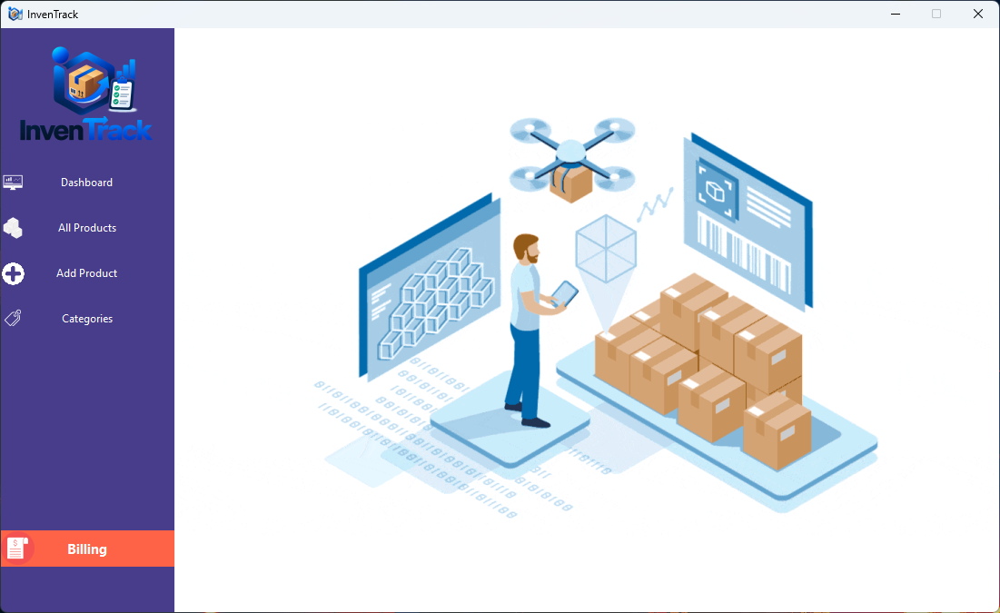
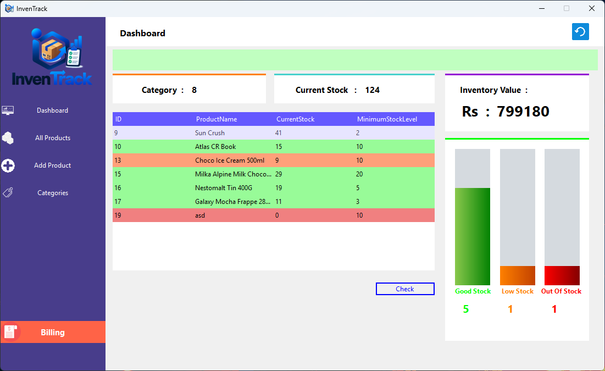
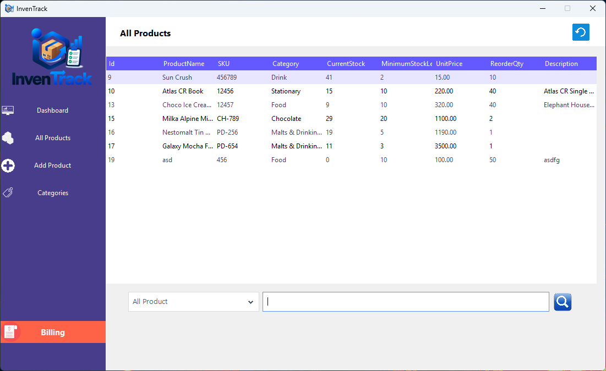
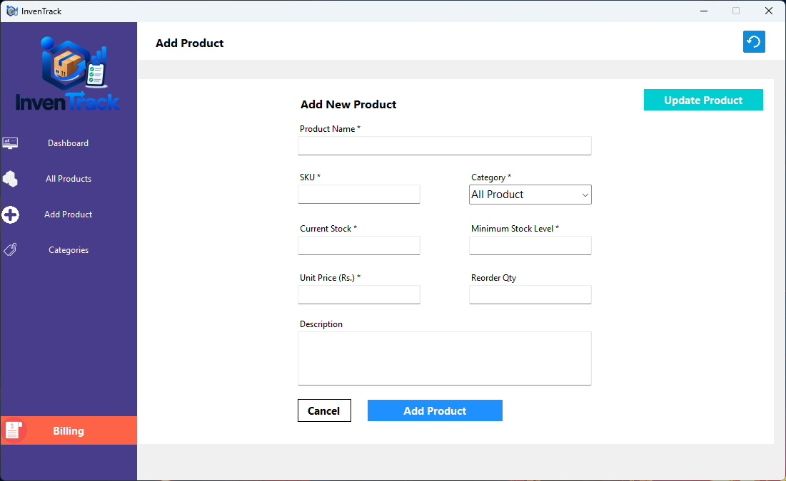
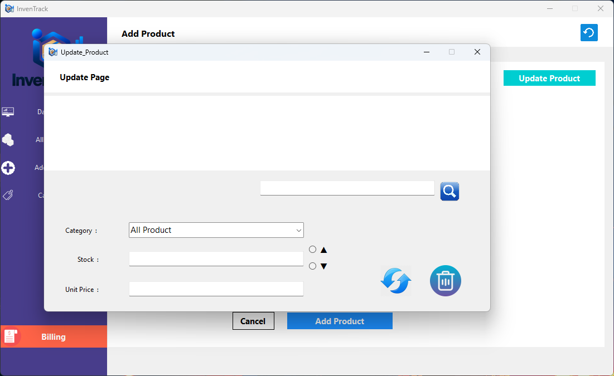
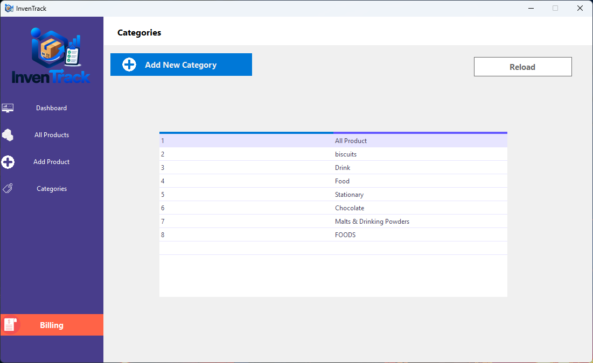
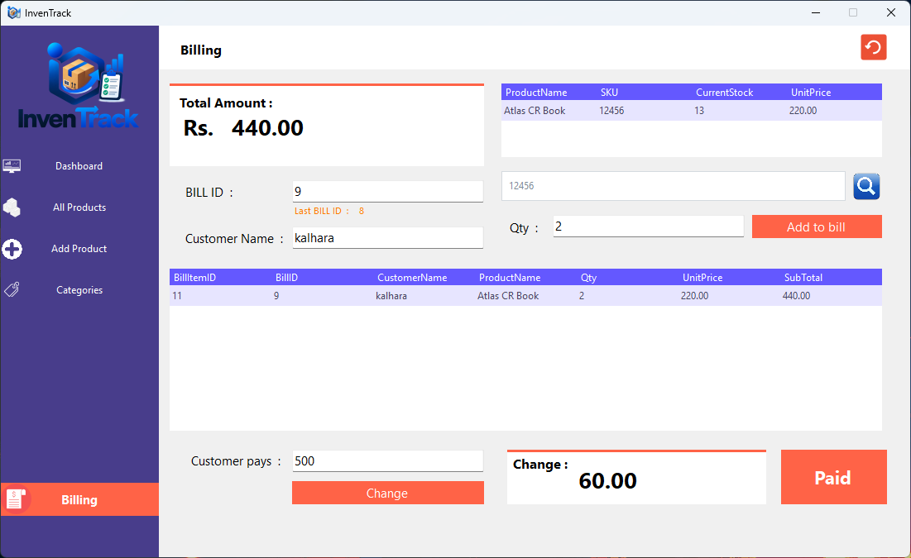

#  InvenTrack – Inventory Management System

**InvenTrack** is a desktop-based Inventory Management System developed using **C# Windows Forms** and **SQL Server**. It is designed to help small businesses manage products, categories, stock levels, billing, and inventory information efficiently.

---

## 🧩 Features

###  Product Management

* Add new products
* Update product information
* Delete products
* View all products
* Manage SKU numbers
* Set minimum stock levels
* Set reorder quantities
* Add product descriptions

###  Category Management

* Create product categories
* Assign products to categories
* Load categories dynamically
* View category information

###  Product Search

Search products using:

* Product ID
* Product Name
* SKU

###  Inventory Dashboard

The dashboard provides useful inventory statistics such as:

* Total number of categories
* Inventory value
* Current stock information
* Minimum stock level information
* Low-stock product identification
* Stock progress indicators

###  Low Stock Detection

Products that reach or fall below their minimum stock level can be identified easily.

This helps the user know which products need to be reordered.

###  Billing System

InvenTrack includes a basic billing system with:

* Customer name
* Product selection
* Quantity
* Unit price
* Subtotal
* Total amount
* Paid amount
* Change calculation

###  Data Visualization

The system can display inventory information using charts such as:

* 📊 Bar Charts

These charts make inventory information easier to understand.

---

## 🛠️ Technologies Used

| Technology        | Purpose                 |
| ----------------- | ----------------------- |
| **C#**            | Application development |
| **Windows Forms** | Desktop user interface  |
| **.NET**          | Application framework   |
| **SQL Server**    | Database management     |
| **ADO.NET**       | Database connectivity   |
| **Visual Studio** | Development environment |

---

---

## ⚙️ Installation

### 1. Clone the Repository

```bash
git clone https://github.com/your-username/InvenTrack.git
```

## 📸 Screenshots

Add your application screenshots here:

```markdown
```
|  |  |

|  |  |  |

|  |  |

---

## 🎯 Project Goals

The main goals of InvenTrack are:

* Simplify inventory management
* Reduce manual stock tracking
* Identify low-stock products
* Manage product information efficiently
* Simplify billing
* Provide useful inventory statistics
* Visualize inventory data

---
## 👨‍💻 Author

**Kalhara Nonis**

[](https://www.linkedin.com/in/kalhara-nonis/)
